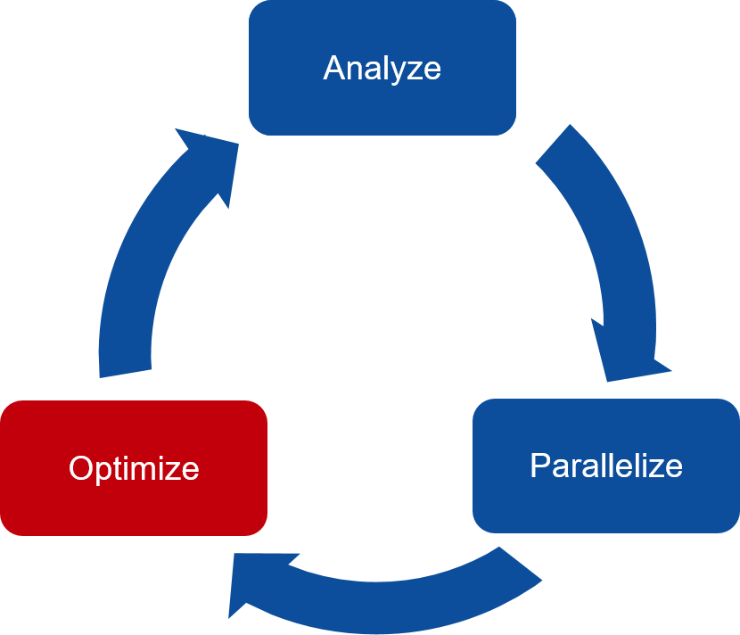
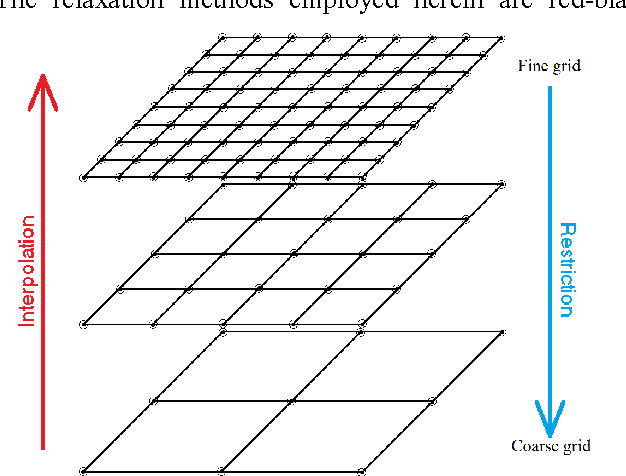

.. _openacc-profiling:

OpenACC: Analysis and Parallelization
=====================================

What is OpenACC ?
-----------------

-  OpenACC defines a set of compiler directives that allow code regions
   to be offloaded from a host CPU to be computed on a GPU

   -  High level GPU programming
   -  Large similarity to OpenMP directives

-  Support for both C/C++ and Fortran bindings
-  Extensive guides, tutorials, code samples and documentation on the OpenACC standard
   can be found at `www.openacc.org <http://www.openacc.org>`_.

OpenACC vs. CUDA or HIP
-----------------------

-  Why OpenACC and not `CUDA <https://en.wikipedia.org/wiki/CUDA>`_ / `HIP <https://en.wikipedia.org/wiki/GPUOpen#AMD_Boltzmann_Initiative>`_?

   -  Easier to work with
   -  Porting of existing software requires less work
   -  Same code can be compiled to CPU and GPU versions easily

-  Why CUDA/HIP and not OpenACC?

   -  Get access to all features of the GPU hardware
   -  More optimization possibilities

Steps in porting code to GPUs
-----------------------------
-  The three key steps in porting to high performance accelerated code:

   1. Analyze/Identify parallelism
   2. Express data movement and parallelism
   3. Optimize data movement and loop performance
   4. Go back to 1!

- *Analyze* your code to determine most likely places needing parallelization or optimization.

- *Parallelize* your code by starting with the most time consuming parts and check for correctness.

- *Optimize* your code to improve observed speed-up from parallelization.

.. - One should generally start the process at the top with the analyze step. For complex applications, it's useful to have a profiling tool available to learn where your application is spending its execution time and to focus your efforts there.  Since our example code is quite a bit simpler than a full application, we'll skip profiling the code and simply analyze the code by reading it

The Himeno stencil benchmark
^^^^^^^^^^^^^^^^^^^^^^^^^^^^

Solving Poisson’s equation for incompressible fluid by the Jacobi iteration method.

.. image:: img/himeno_stencil.png

(https://blogs.fau.de/hager/archives/7850)

The NAS parallel benchmark MG
^^^^^^^^^^^^^^^^^^^^^^^^^^^^^

Multi-Grid on a sequence of meshes for computational fluid dynamics applications

(https://developer.nvidia.com/blog/high-performance-geometric-multi-grid-gpu-acceleration/)

Analysis and Parallelization
----------------------------

- Serial Computing on CPU

.. image:: img/serial_openaccc.png

- Porting to GPU

.. image:: img/parallel_openacc.png

- NVIDIA nvprof provides a simple interface to collect on a target without using the GUI. (new NSight system)

  - GPU profiling capabilities: High-level usage statistics, Timeline collection, Analysis metrics
  - basic CPU sampling

.. typealong:: himeno code

    .. tabs::

        .. tab:: c

            .. literalinclude:: ../examples/OpenACC/himeno/C/himeno_C.c
                :language: c

        .. tab:: fortran

            .. literalinclude:: ../examples/OpenACC/himeno/F/himeno_f77.f
                :language: fortran

.. code:: bash

 $ srun -n 1 nvprof --cpu-profiling on --cpu-profiling-mode top-down ./himeno.x
 ======== CPU profiling result (top down):
 Time(%)      Time  Name
 85.74%    18.16s  jacobi
  7.46%     1.58s  initmt
  0.94%     200ms  | ???
  6.75%     1.43s  __c_mcopy4_sky
  0.05%      10ms  __c_mcopy4

OpenACC data model
^^^^^^^^^^^^^^^^^^
-  Define a region with data declared in the device memory

   -  C/C++: ``#pragma acc data [clauses]`` 
   -  Fortran: ``!$acc data [clauses]``
   -  clauses can be ``copy``, ``copyin``, ``copyout``, and ``present``

-  Data transfers take place

   -  from the **host** to the **device** upon entry to the region
   -  from the **device** to the **host** upon exit from the region

-  Functionality defined by *data clauses*
-  *Data clauses* can also be used in ``kernels`` and ``parallel``
   constructs

OpenACC execution model
^^^^^^^^^^^^^^^^^^^^^^^

-  OpenACC includes two different approaches for defining parallel
   regions

   -  ``kernels`` defines a region to be transferred into a series of
      kernels to be executed in *sequence* on an accelerator. Work
      sharing parallelism is defined *automatically* for the separate
      kernels, but tuning prospects limited.

   -  ``parallel`` defines a region to be executed on an accelerator.
      Work sharing *parallelism* has to be defined *manually*. Good
      tuning prospects. 

   -  C/C++: ``#pragma kernels``, ``#pragma parallel loop`` 
   -  Fortran: ``!acc kernels``, ``!$acc parallel loop``

-  With similar work sharing, both can perform equally well

