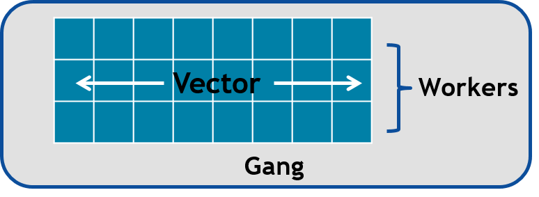

.. _openacc-optimization:

OpenACC: Optimization
=====================

- Data movement is an important part to optimize when using GPUs
    - Keeping data on the GPU as long as possible
- Getting the compiler to generate parallel code
    - Addressing loop performance optimization
- Data access and execution divergence are important for GPU performance

Optimizing data movement
^^^^^^^^^^^^^^^^^^^^^^^^

-  Constructs and clauses for

   -  defining the variables on the device
   -  transferring data to/from the device

-  All variables used inside the ``parallel`` or ``kernels`` region will
   be treated as *implicit* variables if they are not present in any
   data clauses, i.e. copying to and from to the device is automatically
   performed

-  Minimize the data transfer between host and device

.. code :: c 

 #pragma acc parallel loop private(i,j,k,s0,ss) reduction(+:gosa)
 for(i=1 ; i<imax-1 ; ++i)

(refer to *examples/OpenACC/himeno/solution/C/himeno_C_v01.c*)

.. code :: c

 $ export PGI_ACC_TIME=1
 $ ./himeno.x
  jacobi  NVIDIA  devicenum=0
    time(us): 24,912,728
    215: compute region reached 4 times
        215: kernel launched 4 times
            grid: [510]  block: [128]
             device time(us): total=6,735 max=1,693 min=1,678 avg=1,683
            elapsed time(us): total=6,998 max=1,763 min=1,741 avg=1,749
        215: reduction kernel launched 4 times
            grid: [1]  block: [256]
             device time(us): total=17 max=5 min=4 avg=4
            elapsed time(us): total=104 max=28 min=25 avg=26
    215: data region reached 8 times
        215: data copyin transfers: 3115092
             device time(us): total=18,715,892 max=787 min=4 avg=6
        237: data copyout transfers: 518164
             device time(us): total=6,190,084 max=230 min=11 avg=11
 
.. code :: c

 #pragma acc data copyin(a,b,c,bnd,wrk1) copy(p) create(wrk2)
  {
  for(n=0;n<nn;++n){
    gosa = 0.0;

 #pragma acc parallel loop private(i,j,k,s0,ss) reduction(+:gosa)
    for(i=1 ; i<imax-1 ; ++i)
      for(j=1 ; j<jmax-1 ; ++j)
        for(k=1 ; k<kmax-1 ; ++k){

(refer to *examples/OpenACC/himeno/solution/C/himeno_C_v02.c*)

.. code :: c

 $ export PGI_ACC_TIME=1
 $ ./himeno.x
  jacobi  NVIDIA  devicenum=0
    time(us): 389,951
    212: data region reached 4 times
        212: data copyin transfers: 220
             device time(us): total=148,455 max=4,814 min=60 avg=674
        247: data copyout transfers: 18
             device time(us): total=30,017 max=2,130 min=163 avg=1,667
    217: compute region reached 101 times
        217: kernel launched 101 times
            grid: [510]  block: [128]
             device time(us): total=168,823 max=1,734 min=1,656 avg=1,671
            elapsed time(us): total=171,048 max=1,761 min=1,676 avg=1,693
        217: reduction kernel launched 101 times
            grid: [1]  block: [256]
             device time(us): total=560 max=7 min=5 avg=5
            elapsed time(us): total=2,861 max=209 min=24 avg=28
    217: data region reached 202 times
        217: data copyin transfers: 101
             device time(us): total=589 max=14 min=5 avg=5
        239: data copyout transfers: 101
             device time(us): total=1,520 max=24 min=13 avg=15
    242: compute region reached 101 times
        242: kernel launched 101 times
            grid: [510]  block: [128]
             device time(us): total=39,987 max=435 min=389 avg=395
            elapsed time(us): total=42,470 max=467 min=412 avg=420

Optimize Loop performance
^^^^^^^^^^^^^^^^^^^^^^^^^

- The compiler is usually pretty good at choosing how to break up loop iterations to run well on parallel accelerators.

- Sometimes we can obtain more performance by guiding the compiler to make specific choices.

Collapse Clause
---------------

- collapse(N)

  - Same as in OpenMP, take the next N tightly nested loops and flatten them into a one loop
  - Can be beneficial when loops are small
  - Breaks the next loops into tiles (blocks) before parallelizing the loops
  - For certain memory access patterns this can improve data locality

.. - The collapse clause allows us to transform a multi-dimensional loop nest into a single-dimensional loop. This process is helpful for increasing the overall length (which usually increases parallelism) of our loops, and will often help with memory locality.

.. code :: c

 #pragma acc parallel loop collapse(3) private(i,j,k,s0,ss) reduction(+:gosa)
    for(i=1 ; i<imax-1 ; ++i)
      for(j=1 ; j<jmax-1 ; ++j)
        for(k=1 ; k<kmax-1 ; ++k){

(refer to *examples/OpenACC/himeno/solution/C/himeno_C_v03.c*)

.. code :: c

 $ export PGI_ACC_TIME=1
 $ ./himeno.x
  jacobi  NVIDIA  devicenum=0
    time(us): 4,062,105
    221: data region reached 4 times
    226: compute region reached 2214 times
        226: kernel launched 2214 times
            grid: [65535]  block: [128]
             device time(us): total=3,252,373 max=1,560 min=1,465 avg=1,469
            elapsed time(us): total=3,296,349 max=1,664 min=1,484 avg=1,488
        226: reduction kernel launched 2214 times
            grid: [1]  block: [256]
             device time(us): total=260,194 max=261 min=114 avg=117
            elapsed time(us): total=304,827 max=344 min=133 avg=137
 
Loop directives
---------------

- Loop directive accepts several fine-tuning clauses, OpenACC has three levels of parallelism

 - ``gang`` -- have one or more workers that share resources, such as streaming multiprocessor - Multiple gangs work independently
 - ``worker`` -- compute a vector
 - ``vector`` -- threads work in SIMT (SIMD) fashion 
 - ``seq`` -- run sequentially

- Multiple levels can be applied to a loop nest, but they have to be applied in top-down order
- By default, when programming for a GPU, gang and vector parallelism is automatically applied.

This image represents a single gang. When parallelizing our for loops, the loop iterations will be broken up evenly among a number of gangs. Each gang will contain a number of threads. These threads are organized into blocks. A worker is a row of threads. In the above graphic, there are 3 workers, which means that there are 3 rows of threads. The vector refers to how long each row is. So in the above graphic, the vector is 8, because each row is 8 threads long.

.. code :: c

 #pragma acc parallel num_gangs( 2 ) num_workers( 4 ) vector_length( 32 )
 {
    #pragma acc loop gang worker
    for(int i = 0; i < N; i++)
    {
        #pragma acc loop vector
        for(int j = 0; j < M; j++)
        {
            < loop code >
        }
    }
 }

- Avoid wasting Threads, when parallelizing small arrays, you have to be careful that the number of threads within your vector is not larger than the number of loop iterations.

.. code :: c

 #pragma acc kernels loop gang
 for(int i = 0; i < 1000000000; i++)
 {
    #pragma acc loop vector(256)
    for(int j = 0; j < 32; j++)
    {
        < loop code >
    }
 }

- The Rule of 32 (Warps): The general rule of thumb for programming for NVIDIA GPUs is to always ensure that your vector length is a multiple of 32 (which means 32, 64, 96, 128, ... 512, ... 1024... etc.). This is because NVIDIA GPUs are optimized to use warps. Warps are groups of 32 threads that are executing the same computer instruction.

(refer to *examples/OpenACC/MG/solution/C/MG/mg_v0[1-8].c*)

What values should I try?
-------------------------

- Depends on the accelerator you are using
- You can try out different combinations, but deterministic optimizations require good knowledge on the accelerator hardware

  - In the case of NVIDIA GPUs you should start with the NVVP results and refer to CUDA documentation
  - One hard-coded value: for NVIDIA GPUs the vector length should always be 32, which is the (current) warp size

Device data interoperability
----------------------------

- OpenACC includes methods to access to device data pointers
- Device data pointers can be used to interoperate with libraries and other programming techniques available for accelerator devices
  - CUDA kernels and libraries
  - CUDA-aware MPI libraries

Calling CUDA-kernel from OpenACC-program
----------------------------------------

- Define a device address to be available on the host
  - C/C++: **#pragma acc host_data [clause]**
  - Fortran: **!$acc host_data [clause]**
- Only a single clause is allowed: C/C++, Fortran: use_device(var-list)
- Within the construct, all the variables in var-list are referred to by using their device addresses

.. code:: c
 #pragma acc data present(u[0:n1*n2*n3],v[0:n1*n2*n3],a[0:4],r[0:n1*n2*n3])
    {
 #pragma acc host_data use_device(u,v,r,a)
      {
        resid_cuda(u,v,r,&n1,&n2,&n3,a);
      }
    }

(refer to *examples/OpenACC/MG/solution/C/MG/mg_v08.c*)

.. code:: c
  extern "C" void resid_cuda(double *u, double *v, double *r,
                             int *n1, int *n2, int *n3,
                             double *a)
 
(refer to *examples/OpenACC/MG/solution/C/MG/mg_kernels.cu*)

Summary
-------

- Profiling is essential for optimization

  - NVPROF and NVVP for NVIDIA platform

- Data and Loop optimizations
