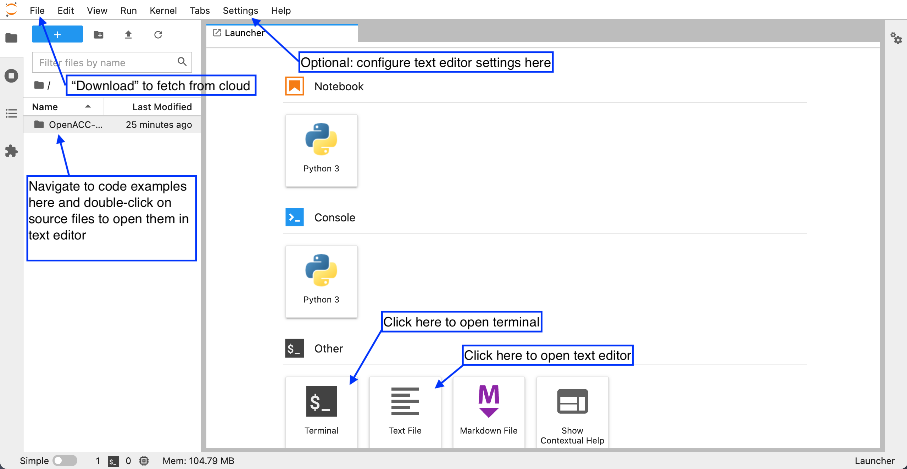
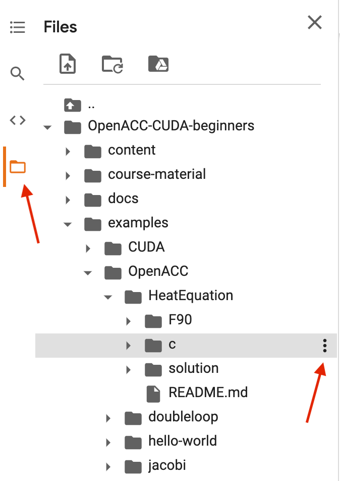

.. _setup:

Setup
=====

In order to follow type-along sessions and do exercises in this lesson
you will need access to a computational resource with GPUs and
installations of CUDA and compilers supporting OpenACC.

.. callout:: Where to run the exercises

   During an ENCCS workshop the primary way to do the exercises is to use
   the virtual cloud-based cluster available to workshop participants.
   You can find instruction for http://cloud.enccs.se below.

   If you do not have access to the ENCCS virtual cluster but you have
   a user account on another GPU cluster you can use that instead -
   note however that you will need to adapt the instructions below
   according to the specifics of that cluster.

   If you do not have access to any GPU cluster, you can follow the
   instructions below on how to use Google Colab.

   
.. callout:: Download example codes

  The C and Fortran codes used for exercises in this lesson are contained
  in the same Git repository as the lesson material, so it is best to clone
  the repository by::

    # On cloud.enccs.se or another machine without ssh keys:
    git clone https://github.com/ENCCS/OpenACC-CUDA-intermediate.git
    # On another system if you have set up ssh keys on GitHub:
    git clone git@github.com:ENCCS/OpenACC-CUDA-intermediate.git

  After that, navigate to the examples directory::

    cd OpenACC-CUDA-intermediate/examples

  OpenACC examples are contained in the ``OpenACC`` directory and CUDA examples
  are in the ``CUDA`` directory.

Running on cloud.enccs.se
-------------------------

How to log in
^^^^^^^^^^^^^

.. warning:: 

   The following steps only work if you are attending an ENCCS
   workshop and you have sent your GitHub username to the workshop
   organisers.

Visit http://cloud.enccs.se in your web browser. Your browser might complain
about the connection being insecure, but click to proceed anyways (there is no
risk involved!).

Click the orange "Sign in with GitHub" button and provide your GitHub username
and password.

Navigating the interface
^^^^^^^^^^^^^^^^^^^^^^^^

After login you will find yourself in a JupyterLab session running in the cloud.
The image below demonstrates the key steps:

1. Start by opening a terminal.
2. In terminal, clone the lesson repository:
   ``git clone https://github.com/ENCCS/OpenACC-CUDA-intermediate.git``
3. In the left-hand side-bar, navigate to the ``examples`` directory where you
   can find code examples under the ``OpenACC`` and ``CUDA`` subdirectories.
   Double-clicking a file opens it up in the JupyterLab text editor.
4. Optional: You can configure the text editor under the "Settings" menu.
5. If you want to download a file to your local computer, select "Download" under the
   "File" menu.

Compiling code
^^^^^^^^^^^^^^

WRITEME

	   
Running jobs
^^^^^^^^^^^^

From terminal you have access to the SLURM scheduler, which is used to
send jobs to the GPU compute nodes.
An example job script is as follows (update as needed before submitting):

.. code:: bash

   #!/bin/bash
   #SBATCH -t 00:10:00
   #SBATCH -o output.o
   #SBATCH -e error.e
   #SBATCH -N 1

   ./executable.x > log.$SLURM_JOBID.txt 2>&1	  

To run a job on a GPU compute node, save the job script (e.g. as `job.sh`)
and submit it by:

.. code::

   sbatch job.sh

While your job is running you can monitor it by ``squeue`` or
``squeue -u <your-username>``.

     

Running on Google Colab
-----------------------

If you do not have access to cloud.enccs.se to to any HPC clusters with GPUs, a fallback option
can be to use the `Google Colab service <https://colab.research.google.com/>`__
where you can get access to GPUs in the cloud through Jupyter notebooks.
**Note: This requires that you have a Google account.**

- First click the "Open in Colab" button on
  https://github.com/ENCCS/OpenACC-CUDA-intermediate and enter your Google login information.
- A Google-flavored Jupyter notebook should open on Colab which contains commands to get up and
  running on Colab. You need to press ``SHIFT-ENTER`` on the cells to execute them.
- To get access to a GPU, click on the *Runtime* menu and select *Change runtime type*.
  Choose GPU as a Hardware accelerator. It might take a minute for your notebook to
  connect to a GPU.
- To check whether a GPU has been connected to your session, run the code cell with the ``!nvidia-smi``
  command by hitting ``SHIFT-ENTER`` on it.
- Click through the next few cells to clone the material, change to the colab branch and enter the
  exercise directories.

All work on Google Colab needs to be done through a Jupyter notebook.
Here is how you can work on the exercises:

- New code or text (markdown) cells can be created by clicking the "+Code" and "+Text" buttons,
  or through the keyboard shortcut ``CTRL-m b``. Cells can be deleted by ``CTRL-m d``.
  Cells are executed by pressing ``SHIFT-ENTER`` or pressing the Play button. Pressing instead
  ``ALT-ENTER`` runs a cell and creates a new one underneath, while ``CTRL-ENTER`` runs the cell
  and stays on the same cell.
- General shell commands can be entered into a code cell by prepending it with
  exclamation mark (e.g. ``!ls``). Some shell commands have corresponding "magic" commands (e.g. "%ls"),
  and some commands need to use the magic form. In particular, to change directory you need ``%cd some/path``.
- Explore the directory structure by clicking on the *Files* symbol in the left-hand
  panel and navigate the *OpenACC-CUDA-beginners / examples* directory (see red arrow in image below).
- In the file browser, navigate to the subfolder of the exercise you wish to work on and
  click on the three dots next to the directory and select "Copy path" (see red arrow in image below).
- In a code cell, paste the path into a ``%cd`` magic command to change directory.
- After changing directory, you can for example compile code with Makefiles by ``!make``. 
- You can open a text editor by double-clicking a file. This opens an editor on the right of the
  notebook and you can edit it there and save by hitting ``CTRL-s`` or going through the *File* menu.
  **Note**: it is for some reason impossible to open files with ``.cu`` ending in the Colab editor,
  so open instead the symbolic links with ``.cpp`` ending when working on these files. 
  

